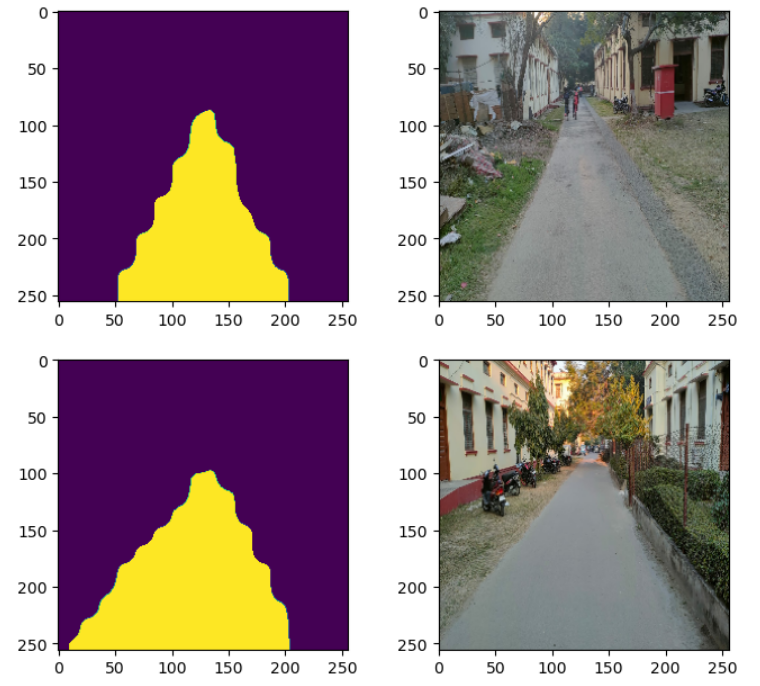
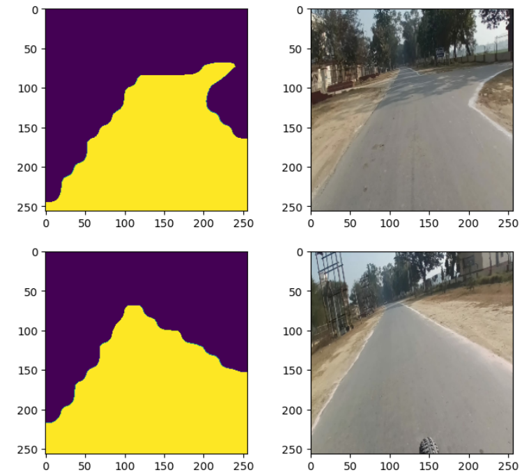

# SEMANTIC SEGMENTATION OF INDIAN ROADS USING `DEEPLABV3+` ARCHITECTURE

### 1.) USED THE `IDD DATASET` (BY IIIT HYDERABAD).
### 2.) MADE TRAINING PIPELINE USING THE `DATA API` OF TENSORFLOW.
* FIRST LOADED ALL THE ADDRESSES OF IMAGES AND MASKS.
* MADE A FUNCTION FOR READING, RESIZING AND NORMALIZING THE IMAGES
* MADE A `tf.data.Dataset` OBJECT AND MADE A TRAIN AND VAL DATASET SO AS TO LOAD THE IMAGES AND MASKS IN BATCHES.

### 3.) DEFINED THE MODEL ARCHITECTURE - USED XCEPTION PRETRAINED MODEL AS THE BASE MODEL.
### 4.) CARRIED OUT THE TRAINING PROCESS AND MADE CHECKPOINTER TO SAVE BEST WEIGHTS ONLY.
### 5.) MADE PREDICTION ON CAMPUS ROADS OF IIT BHU FOR INFERENCE AND THEN DEPLOYED THE MODEL INTO THE AUTONOMOUS VEHICLE OF TEAM AVERERA.

